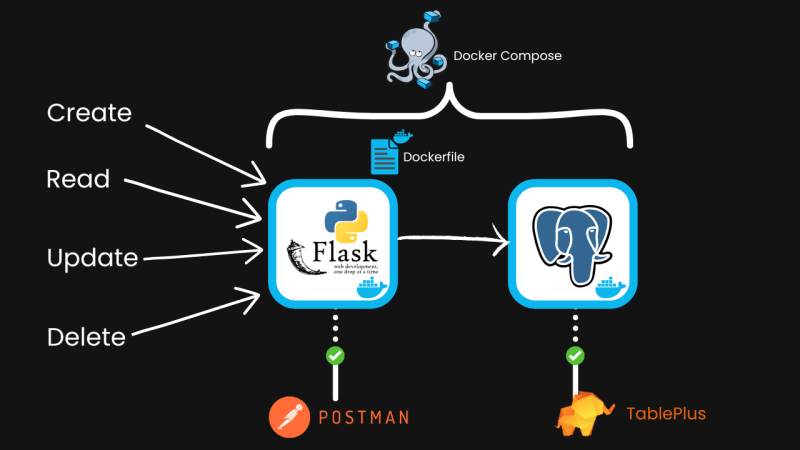

#Project about Flask-CRUD-api:

-
-Here is the picture for you to imagine how the app works
## Description
This code will help us control - create, read, get, post, update, delete the users, email, id.

## Installation
1.How to code and how the code run.

a.  First on requirements.txt: we use flask as a framework. Psycopg2-binary as driver to connect to the Postgres database. Flask-SQLAlchemy is a libraby in python of SQL to make the queries.

b.  Next on app.py, we import: Flask as a framework,request to handle the HTTP, jsonify to handle the json format, not native in Python, make_response to handle the HTTP responses, flask_sqlalchemy to handle the db queries, environ to handle the environment variables,
   - Also on app.py, we are initializing a Flask application and configuring it to use SQLAlchemy to connect to a database whose address is provided via the 'DB_URL' environment variable. SQLAlchemy will help us work with the database by creating model classes for the tables, and we will not need to write SQ statements directly
   - And next, we create define the User Model and Columns in the User Table(id is integer, and also primary key; username is string(80) , 2 users cant have the same name, and this column can not be empty; also email is string(120), 2 users cant have the same name, and this column can not be empty). After that we define a method named json within the User class, and return the true thing (id , username, email)
   - We wil create the Database Table
   - After those steps, we will create the CRUD( CREATE - READ - UPDATE - DELETE): Create a test route -> Create a user -> get all user -> Get a user by an id -> Update a user -> Delete a user
   - 
c.  Next step, we move on Dockerfile, here, we set the images, the working directory inside the image, copy the requirements.txt file to the working directory, and also install the requirements, of course we copy all the files in the current directory to the working directory too, next we expose the port 4000, and set the command to run when the container starts.

d.  Last step on VScode, we move on docker-compose.yml, here, we define 2 sevices: flask_db and flask_app.
    - First, we choose the true version for docker-compose: 3.9
    - We list and define each service:
        -> we set the 'container name' is the same the service and set the name of 'image'(dockerhub for free ), 'build,' is the path to the Dockerfile, ports is the list of ports we want to expose, 'environment' is to define the environment variables, 'depends_on' is the list of services we want to start before this one(flask_db > flask_app) , 'volumes' at the end of the file is the list of volumes we want to create.
	
2. Going on app [TablePlus](#tableplus).
* Okay next, we will download on https://tableplus.com/ and open 'TablePlus' to check then we are done 1/2.
* After open that app, in terminal of VScode, we type "docker compose up -d flask_db" to run a container based on the Postgres image, and next type "docker compose logs" to check if the container is running".If "database system is ready to accept connections" , that mean the code is running and ready to connect. Now, we open the 'TablePlus' to connect. We press '+' and choose 'PostgreSQL' -> on 'Host' , we type 'localhost',on port is '5432'(is the port of flask_db), on user, password and database are 'postgres'-> then we 'Test', if it's reported "Connect is ok" -> we connect. And when we see an empty table-> it's done this step.
3. Next to the last app to check our code if it works [Postman](#postman)
*  We download on http://postman.com/ and open postman to test the code's logic. After opening, we type the 'http' from the code to postman: "localhost:4000/user". If we want to test , we will use "localhost:4000/test". And of course, we choose Body-> Raw (JSON) cause we used 'jsonify' on code. When we 'get' or 'create a new user' or 'delete', we have to type "," before down the line:
  	- {
 	- (max its 80)        "username": "...",
	- (max its 120)       "email": "...@gmail.com"
  	- }
